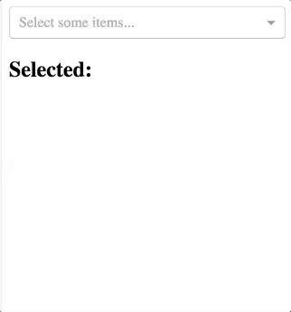

# React Multi Select Component

This library is forked from @khanacademy/react-multi-select
React Multi Select Component



[Storybook Demo](https://github.com/mukulbhardwaj1313/react-multi-select/)

## Installation:
`npm install --save mukulbhardwaj1313/react-multi-select`
`yarn add mukulbhardwaj1313/react-multi-select`

## Usage:
See the examples in `/src/stories/index.js` for how to use the component, but here is a minimum required setups:

```
import React from 'react';
import MultiSelect from "mukulbhardwaj1313/react-multi-select";

const options = [
  {label: "One", value: 1},
  {label: "Two", value: 2},
  {label: "Three", value: 3},
];

class Consumer extends React.Component {
  state = {
    selected: [],
  }

  render() {
    const {selected} = this.state;

    return <MultiSelect
      options={options}
      selected={selected}
      onSelectedChanged={selected => this.setState({selected})}
    />
  }
}
```


## i18n:
You can override the strings to be whatever you want, including translations for your languages.

```
<StatefulMultiSelect
    overrideStrings={{
        selectSomeItems: "Select Some items...",
        allItemsAreSelected: "All Items are Selected",
        selectAll: "Select All",
        search: "Search",
    }}
/>
```
